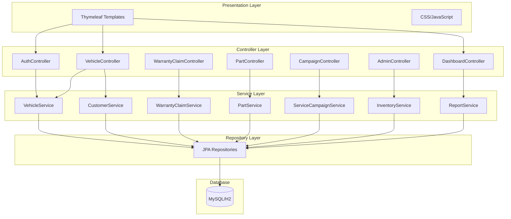

# System Architecture

## Overview
The EV Warranty Management System follows a layered MVC architecture with Spring Boot.

## Packages

| Package | Purpose |
|---------|---------|
| `config` | Spring Security, Web MVC configuration |
| `controller` | Thymeleaf MVC controllers |
| `model` | JPA entity classes |
| `repository` | Spring Data JPA repositories |
| `service` | Business logic layer |

## Security

Spring Security with form-based authentication:
- URL-based access control by role
- BCrypt password encoding
- Session management

### Role-Based Access

| Role | Access | Description |
|------|--------|-------------|
| SC_STAFF | /sc/**, /dashboard | Full service center ops |
| SC_TECHNICIAN | /sc/**, /dashboard | Limited to assigned work |
| EVM_STAFF | /evm/**, /dashboard | Manufacturer operations |
| ADMIN | /** | Full system access |
