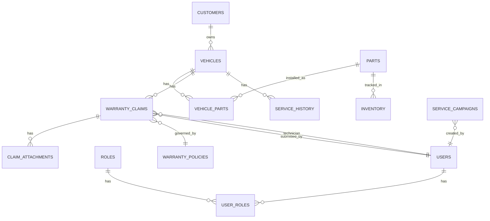

# Database Schema

## Entity Relationship

## Tables

### Core Tables

| Table | Description |
|-------|-------------|
| users | System users with roles |
| roles | Role definitions (SC_STAFF, SC_TECHNICIAN, EVM_STAFF, ADMIN) |
| customers | Vehicle owners |
| vehicles | EV vehicles with VIN and warranty info |
| parts | OEM parts catalog |
| vehicle_parts | Installed parts on vehicles |

### Warranty Tables

| Table | Description |
|-------|-------------|
| warranty_policies | Warranty rules and coverage |
| warranty_claims | Claim records with lifecycle |
| claim_attachments | Supporting documents |

### Operations Tables

| Table | Description |
|-------|-------------|
| service_campaigns | Recall/service campaigns |
| service_history | Vehicle service records |
| inventory | Parts stock at service centers |

## Key Constraints

- **VIN**: Unique 17-character alphanumeric
- **Part Number**: Unique part identifier
- **Serial Number**: Unique for installed parts
- **Claim Number**: Auto-generated (WC + timestamp)
- **Campaign Number**: Auto-generated (SC + timestamp)
