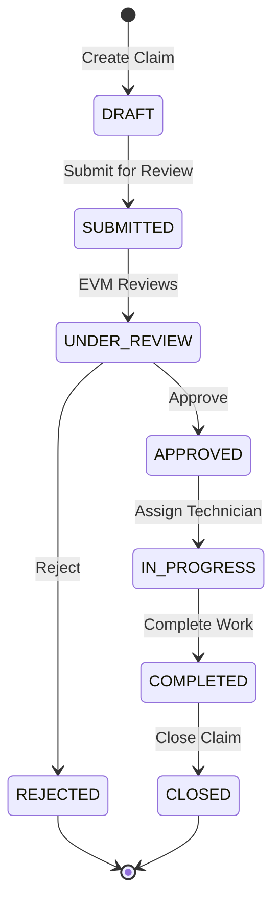
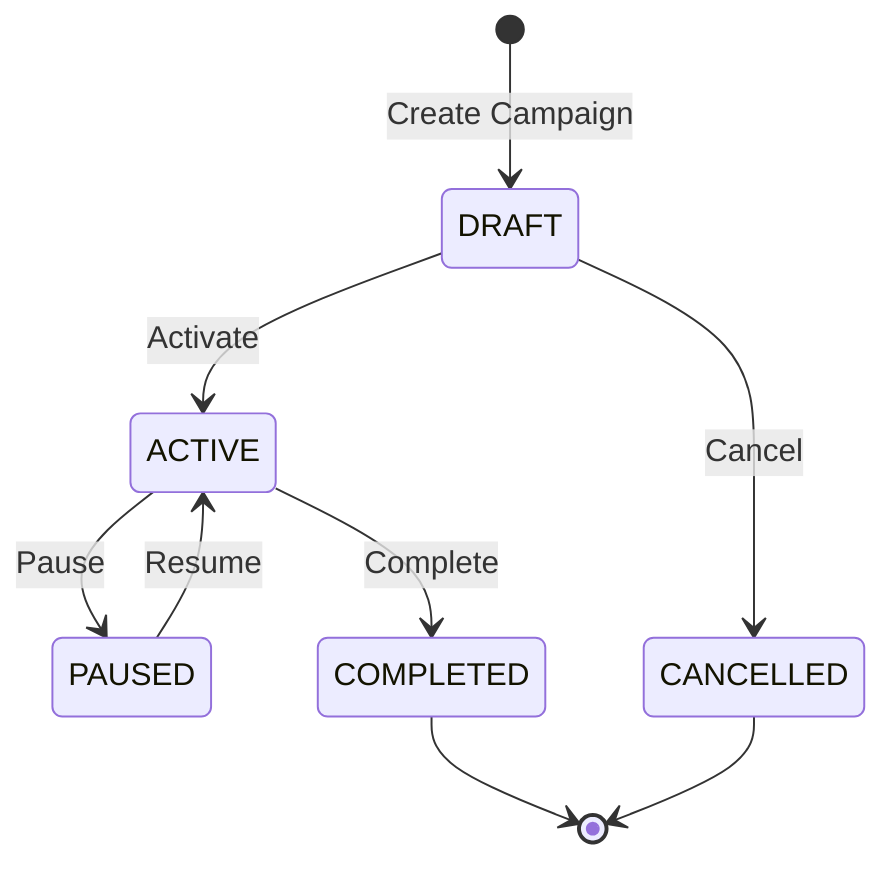

# Business Flows

## Warranty Claim Workflow

### Actors & Actions

| Status | SC Staff | SC Tech | EVM Staff |
|--------|----------|---------|-----------|
| DRAFT | Create, Edit, Submit | View | - |
| SUBMITTED | View | View | Review |
| UNDER_REVIEW | View | View | Approve/Reject |
| APPROVED | Assign Tech | View | View |
| IN_PROGRESS | View | Work, Update | View |
| COMPLETED | Close | View | View |

## Service Campaign Workflow

## Vehicle Registration Flow

1. SC Staff creates customer (optional)
2. SC Staff registers vehicle with VIN
3. System validates VIN format
4. System sets warranty dates (default 3 years)
5. Vehicle available for claims

## Inventory Management

1. EVM Staff adds parts to catalog
2. SC Staff adds inventory at their center
3. System tracks stock levels
4. Low stock alerts on dashboard
